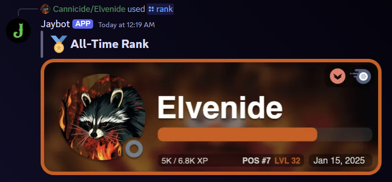
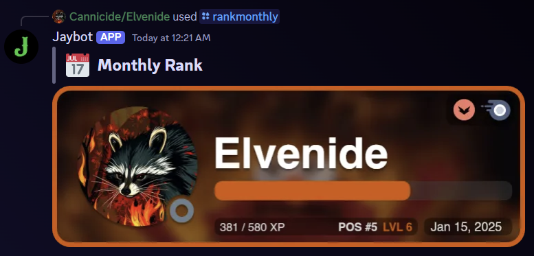
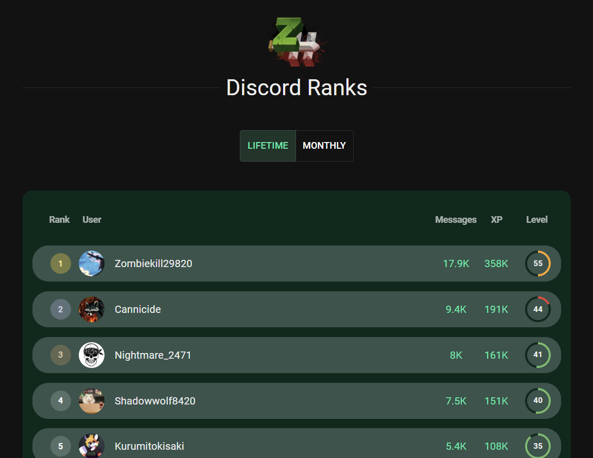
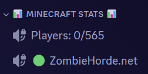
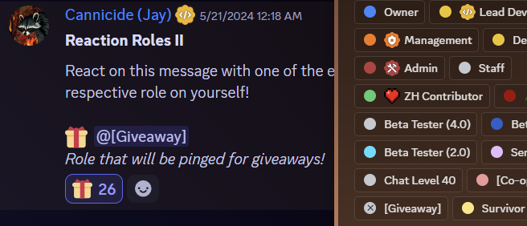
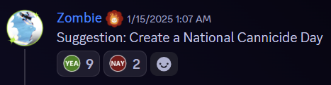

# Jaybot
An open-source Discord bot for the Zombie Horde Minecraft server, built with a TypeScript-Discord.js-ExpressJS backend, React frontend, and MongoDB database.

Now powered by Cannicide's [Brynjolf suite](https://www.npmjs.com/package/@brynjolf/commands) - a set of efficient, powerful, and adaptive systems for command creation, command handling, and event handling! Combined with TypeScript, this suite makes Discord bot creation easier and more powerful than ever before.

## Features

### Rank System
An advanced rank system that rewards users with XP when they send messages. Uses a cooldown system to ensure spamming is not rewarded. When users collect enough XP, they level up. A dynamic rank leaderboard webpage made with React allows users to see their standing in their Discord server, and compete with their fellow members for the top 3 spots on the leaderboard. XP is independently tracked monthly and all-time, allowing new members of a Discord server to still be able to compete with longtime veterans in the monthly rank leaderboards.

> **Rank Cards** (`/rank`)\
> 

> **Monthly Rank Cards** (`/rankmonthly`)\
> 

> **Rank Leaderboards** (`/levels`)\
> 

A live example of the Rank Leaderboards page can be found [here](https://zh.cannicide.net/ranks).

### Minecraft Stat Channels
A Discord category channel can be configured to contain two dynamic "stat" channels that show how many players are on the Minecraft server and whether the server is online, respectively. These stat channels automatically update every 6 minutes, allowing users to get mostly accurate information while avoiding Discord's rate limits.

> **Stat Channels** (setup with `/statadmin`)\
> 

### Reaction Roles
An automated system that allows users to react to a Discord message to give themselves a Discord role, with no permissions necessary for normal users and a fairly simple setup process for admins.

> **Reaction Roles** (setup with `/reactionroles`)\
> 

### Suggestion Votes
An automated system that adds yes/no voting reactions to messages sent in suggestion channels that start with the term `Suggestion:`. This is a simpler alternative to Discord's native polls feature. Discord's polls require manually setting up yes/no options, while the Suggestion Votes system does it automatically. Discord's polls also expire after a maximum of 2 weeks, whereas the Suggestion Votes system allows users to vote indefinitely.

> **Suggestion Votes** (only in channels named "suggestions")
> 

### Rule Roles
An automated system that adds a specific role to a user when they accept the Discord rules popup (you must configure this in Server Settings >> Safety Setup >> DM and Spam Protection >> Members must accept rules). This can be used to easily hide content from members that refuse to agree to your rules, or to only show content to those who do accept the rules.